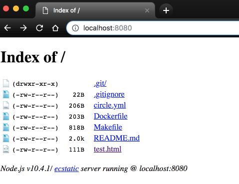

[](http://microbadger.com/#/images/danjellz/http-server "Get your own image badge on microbadger.com") [](https://github.com/danjellesma/http-server/issues) [](https://github.com/danjellesma/http-server/stargazers) [](https://github.com/danjellesma/http-server/network) [](https://circleci.com/gh/danjellesma/http-server/tree/master)

# Http-Server

Run a web server from your current directory without installing Nginx, Nodejs, NPM, etc.

## Basic Functionality

To see basic functionality, run without arguments:

``` bash
docker run -it --rm -p 8080:8080 -v $(pwd):/public danjellz/http-server
```

Output:

``` ruby
Starting up http-server, serving ./
Available on:
  http://127.0.0.1:8080
  http://172.17.0.2:8080
Hit CTRL-C to stop the server
```

You can now visit the site in your web browser:

[]

## Daemon Mode

Like many images you can run your container in daemon mode by using the `-d` switch with the Docker run command:

``` bash
docker run -d -p 8080:8080 -v $(pwd):/public danjellz/http-server
```

## Tips

#### Alias
Creating an alias in your `~/.bashrc` or `~/.zshrc` files can make this command much shorter. Example:

``` bash
alias http-server="docker run -it --rm -p 8080:8080 -v $(pwd):/public danjellz/http-server"
```

Allowing you to run the following and mount your current directory

``` bash
http-server
```

#### Source:

Uses the NPM package found here:
https://www.npmjs.com/package/http-server
